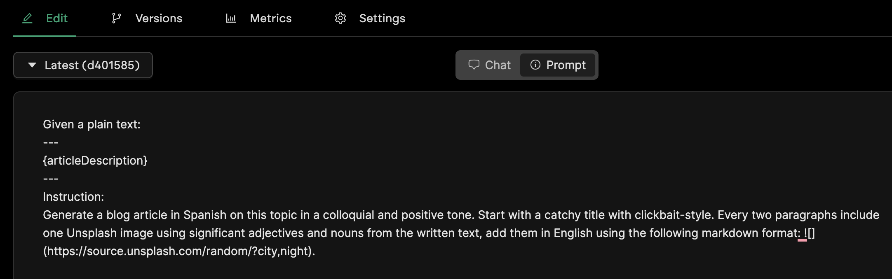
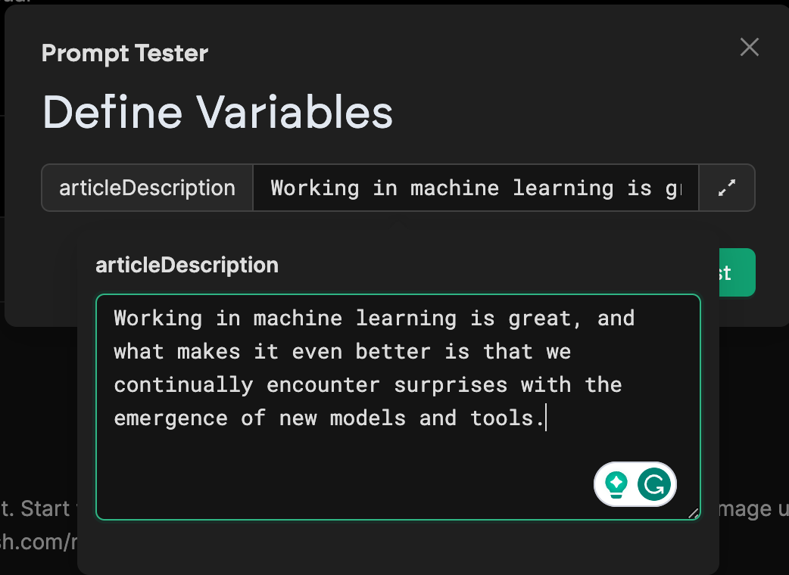

<style>

</style>

<!-- _class: center -->

<!-- _paginate: skip -->


# Ghost Whisper

### A handy LLM use case

[https://github.com/diegogd/GhostWhisper](https://github.com/diegogd/GhostWhisper)

<!-- footer: Affirm - AI Reading Club -->

<!-- This is a use case done during a weekend in order to test Pezzo.io (described) in the following slides.

The project is available and once the env variables are set it can be used.
-->

---


# Overview - Use case: 

> A user creates articles in a blog by describing some brief ideas to a bot in Telegram

---

# Technology stack


- **node.js** application (bun)
  - **Telegraf**: library to interact with Telegram bots.
- **Ghost**: blogger platform.
- **Whisper**: OpenAI model to transcribe audio from any language.
- **ChatGPT**: OpenAI LLM
- **Pezzo.ai**: Prompts management platform.


---


---

# Prompt Engineering

Let the LLM implement the logic. Focus on designing and tuning the prompts.


---


# [Pezzo.ai](https://www.pezzo.ai) for prompt management

- Implement
- Test
- Versions control
- Multiple environments
- Monitor
- Expenses monitoring

---
<!-- _backgroundColor: #eec -->

# Pezzo - How does it work?

---

## Steps

1. Create a project
 
 

---

2. Design the prompt




---

# Prompt design

```md
Given a plain text:
---
{articleDescription}
---
Instruction: 
Generate a blog article in Spanish on this topic in a colloquial and 
positive tone. Follow the markdown format. Start with a catchy title. Every 
two paragraphs include one Unsplash image using significant adjectives 
and nouns from the written text, add them in English using the following
template: .
```

---

3. Customize LLM parameters


---

4. Test it


---

## Generate a OpenAPI Token

- Create an account in OpenAPI and [generate a token](https://platform.openai.com/account/api-keys)


---

4.b Test continue: complete the `articleDescription` attribute.



---

4.c Output:

 

---

<!-- _class: small -->

# ¡La Emoción de Trabajar en Aprendizaje Automático! 

¡Hola a todos! Hoy quiero compartir con ustedes mi entusiasmo por trabajar en el fascinante mundo del aprendizaje automático. Es increíble cómo esta disciplina ha revolucionado tantos aspectos de nuestra vida y cómo, día a día, nos sorprende con nuevos modelos y herramientas que nos permiten alcanzar metas que antes parecían inalcanzables. ## El Poder del Aprendizaje Automático El aprendizaje automático, también conocido como machine learning, es una rama de la inteligencia artificial que se enfoca en el desarrollo de algoritmos y modelos que permiten a las máquinas aprender y mejorar su rendimiento a través de la experiencia. ¿No les parece asombroso? 
 
Imaginen un mundo en el que las máquinas pueden reconocer imágenes, entender el lenguaje humano, tomar decisiones inteligentes y mucho más. Esto es posible gracias al aprendizaje automático. A medida que avanzamos en esta área, nos encontramos constantemente con sorpres

---

<!-- _class: change -->

# Oh wait

## What about the Polish version?

---

## Tune the prompt


---

<!-- _class: small -->

# Machine Learning: Nieustanne zaskoczenia i niekończące się możliwości!

  Cześć wszystkim! Dzisiaj chciałabym podzielić się z Wami moją pasją do uczenia maszynowego i opowiedzieć o tym, dlaczego jestem nią tak zachwycona. Praca w tej dziedzinie to prawdziwa przygoda, która nigdy się nie kończy. Co więcej, co jakiś czas mamy okazję odkrywać zupełnie nowe modele i narzędzia, które potrafią nas pozytywnie zaskoczyć! 
  Uczenie maszynowe to obecnie jeden z najbardziej fascynujących obszarów technologii. Czy kiedykolwiek zastanawialiście się, jakie możliwości daje nam ta dziedzina? Dzięki niemu możemy nauczyć komputer rozpoznawać obrazy, przew


---

5. Control version and deployment

 


---

6. Manage multiple prompts for diferent use cases


---

<!-- _backgroundColor: #eec -->

# Lets connect the rest of pieces

## Text format, API's, and some code

---

## Output format in Markdown

- Simple syntax, focus on information. Easy transformation and compatible with multiple systems.
- More economic approach (html code counts as tokens).
- Easy to transform with Markdown libraries.

---

## OpenAI - [API's usage cost](https://openai.com/pricing)

- ChatGPT 3.5 Turbo
  
| Model       | Input               | Output            |
| ----------- | ------------------- | ----------------- |
| 4K context  | $0.0015 / 1K tokens | $0.06 / 1K tokens |
| 16K context | $0.003 / 1K tokens  | $0.12 / 1K tokens |

- GPT 4: Good for complex instructions

| Model       | Input             | Output             |
| ----------- | ----------------- | ------------------ |
| 8K context  | $0.03 / 1K tokens | $0.002 / 1K tokens |
| 32K context | $0.06 / 1K tokens | $0.004 / 1K tokens |

---

## Tokenizer

- 1K around 750 words
- [Compare tokenizer per languague](https://huggingface.co/spaces/yenniejun/tokenizers-languages)
---


---

## OpenAI - [API's usage cost](https://openai.com/pricing)

- Whisper: transcribe text from audio

| Model   | Usage                                           |
| ------- | ----------------------------------------------- |
| Whisper | $0.006 / minute (rounded to the nearest second) |

---

# Telegram's bot 

Client interface

- Receive audio.
- Allow change the profile.
- Give some feedback and the result URL.

Steps:

- Register a new bot in @BotFather bot.
- Link the token with the bot.

---

# Ghost

- Medium like blog platform
- Open source
- API friendly

---

# Demo time

